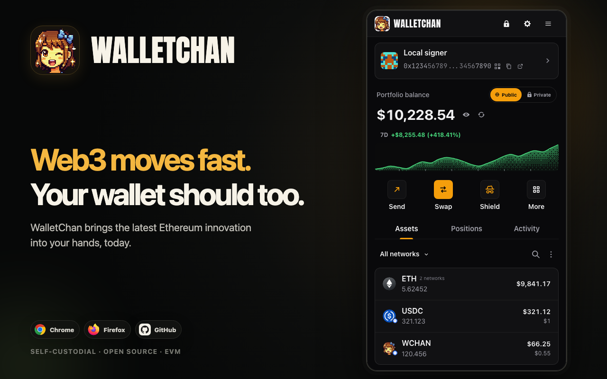
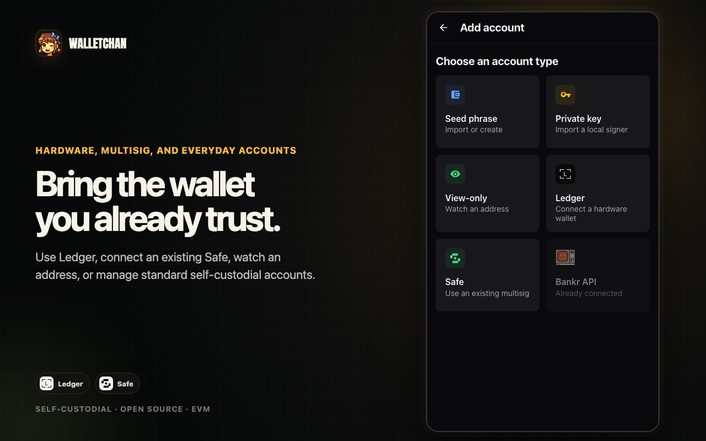
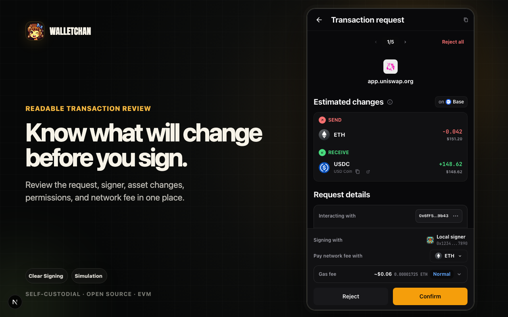
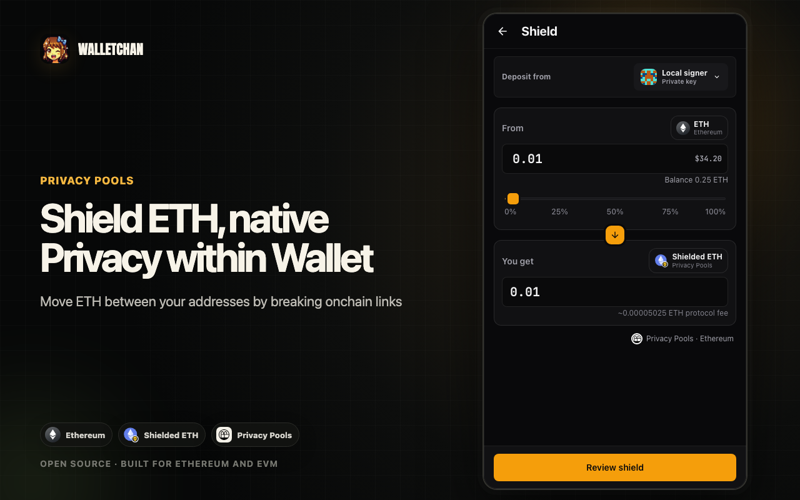
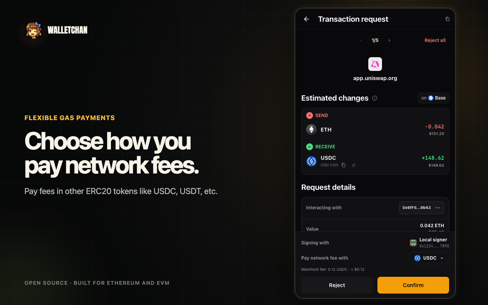
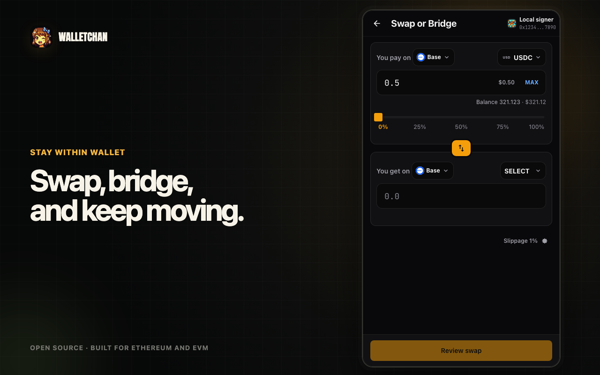

# WalletChan

<!-- Staged for the v4 release. Do not publish before the final v4 package and
public links are verified. -->

<p align="center">
  <strong>Sign smarter. Move faster.</strong>
</p>

<p align="center">
  A self-custodial web3 browser wallet for serious Ethereum and EVM use.
</p>

<p align="center">
  <a href="https://walletchan.com/">Website</a>
  ·
  <a href="https://chromewebstore.google.com/detail/walletchan/kofbkhbkfhiollbhjkbebajngppmpbgc">Chrome Web Store</a>
  ·
  <a href="https://addons.mozilla.org/en-US/firefox/addon/walletchan/">Firefox</a>
  ·
  <a href="https://github.com/apoorvlathey/walletchan/releases/latest">Releases</a>
</p>



WalletChan brings Ledger hardware wallet support, existing Safe multisigs,
Privacy Pools ETH shielding, and supported-token network fees into one redesigned
extension. Readable transaction review runs across the experience so you can
understand what will happen before approving.

It also supports private-key, seed-phrase, view-only, and Bankr API accounts,
along with swaps, bridges, batching, custom networks, and decentralized website
browsing.

## One wallet for every EVM chain

### Use the right account for the job

- Connect Ledger hardware accounts through Chromium WebHID and approve
  transactions and messages on the device.
- Discover or import existing Safe multisigs, review their configuration,
  propose transactions, collect approvals, and execute at quorum.
- Add private-key, seed-phrase, view-only, and Bankr API accounts.
- Assign accounts and networks to connected dapps without repeatedly changing one
  global wallet context.



### Understand what happens before approving

- Review plain-language transaction intent and signer identity.
- Preview simulated asset changes.
- Decode calldata and supported clear-signing descriptors.
- Inspect signature domains, messages, and technical details.
- Batch compatible approvals and actions into fewer confirmations.



### Shield ETH inside the wallet

Shield Ethereum ETH
into a Privacy Pools balance and unshield through supported private-relay,
recipient-paid, or public-recovery paths.

Privacy Pools uses ASP/compliance processing and has minimums and fees. It
currently supports Ethereum ETH Shield/Unshield, not private in-pool transfers.
Public recovery can link the original deposit and exit.



### Pay network fees with supported tokens

Eligible accounts and requests can pay network fees with supported ERC-20 tokens,
including USDC on supported chains. Availability depends on the account, chain,
token, request, and transaction. Ledger accounts use native gas.



### Move across the EVM ecosystem

- Swap and bridge supported assets without leaving the wallet.
- Use built-in EVM networks or add custom RPC endpoints.
- Browse ENS, IPFS, and other supported decentralized names in an ordinary
  browser, with optional local IPFS support.
- Use WalletConnect and injected dapp connections.
- Keep WalletChan open as a popup, side panel, compact view, or full window.



## Privacy and control

- Private keys and seed phrases are encrypted locally.
- Ledger keys remain on the hardware device.
- WalletChan does not add behavioral analytics or advertising trackers to the extension.
- User-invoked features still connect to blockchain RPCs and required service
  providers.
- The extension and its build system are open source.

<!-- Before publishing the v4 README, reconcile PRIVACY_POLICY.md with the
expanded v4 provider and data-flow inventory. -->

## Install

Install the released extension from the
[Chrome Web Store](https://chromewebstore.google.com/detail/walletchan/kofbkhbkfhiollbhjkbebajngppmpbgc)
or [Firefox Add-ons](https://addons.mozilla.org/en-US/firefox/addon/walletchan/).

Developers and prerelease testers can also download the
[latest GitHub release](https://github.com/apoorvlathey/walletchan/releases/latest)
and load the extracted extension from `chrome://extensions` with Developer mode
enabled.

## Build from source

This repository is a pnpm monorepo containing the browser extension,
[website](apps/website/), and supporting apps such as
[WalletChan RPC](apps/walletchan-rpc/) and
[WalletChan MCP](apps/walletchan-mcp/).

### Prerequisites

- Node.js (see [`.nvmrc`](.nvmrc))
- pnpm

```bash
pnpm install
pnpm build:extension
```

The Chromium build is written to `apps/extension/build/`.

See [DEVELOPMENT.md](_docs/DEVELOPMENT.md) for the development workflow and
[IMPLEMENTATION.md](_docs/IMPLEMENTATION.md) for the extension architecture.

## Security

The repository documents its trust boundaries,
storage model, and review checklists in [SECURITY.md](_docs/SECURITY.md) and
[SECURITY_ARCHITECTURE.md](_docs/SECURITY_ARCHITECTURE.md).

## License

This is a multi-license repository. The browser extension is GPL-3.0-only.
Other components remain MIT unless their directory contains a separate license.
See [LICENSE.md](LICENSE.md) and
[apps/extension/LICENSE.md](apps/extension/LICENSE.md).
